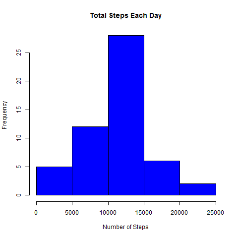
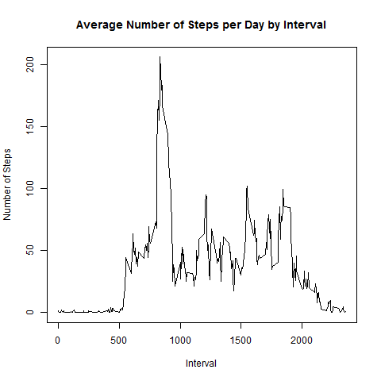
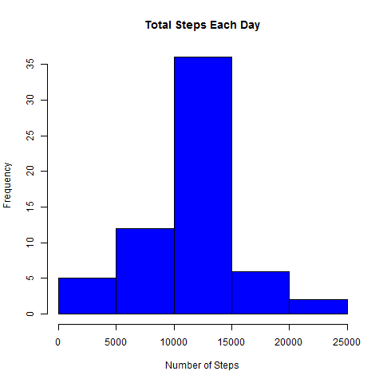
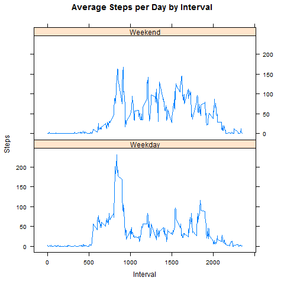

# Reproducible Research: Peer Assessment 1

## Loading and preprocessing the data

```r
unzip(zipfile = "activity.zip")
data <- read.csv("activity.csv")
```


## What is mean total number of steps taken per day?

```r
steps_by_day <- aggregate(steps ~ date, data, sum)
hist(steps_by_day$steps, main = paste("Total Steps Each Day"), col="blue", xlab="Number of Steps")
```
 

```r
mean(steps_by_day$steps)
```

```
## [1] 10766.19
```

```r
median(steps_by_day$steps)
```

```
## [1] 10765
```

## What is the average daily activity pattern?
``` {r}
steps_by_interval <- aggregate(steps ~ interval, data, mean)
plot(steps_by_interval$interval,steps_by_interval$steps, type="l", xlab="Interval", ylab="Number of Steps",main="Average Number of Steps per Day by Interval")
```



On average across all the days in the dataset, the 5-minute interval contains
the maximum number of steps?
``` {r}
max_interval <- steps_by_interval[which.max(steps_by_interval$steps),1]
```

The 5-minute interval, on average across all the days in the data set, containing the maximum number of steps is 835.

## Imputing missing values

There are many days/intervals where there are missing values (coded as `NA`). The presence of missing days may introduce bias into some calculations or summaries of the data.

```{r}
missing_vals <- sum(is.na(data$steps))
```

The total number of missing values are 2304.

* Strategy for filling in all of the missing values in the dataset

To populate missing values, we choose to replace them with the mean value at the same interval across days.
for example if interval 10 was missing on 10-02-2012, the average for that interval for all days (0.1320755), replaced the NA.

```{r}
imputed_data <- transform(data, steps = ifelse(is.na(data$steps), steps_by_interval$steps[match(data$interval, steps_by_interval$interval)], data$steps))
```
* Create a new dataset that is equal to the original dataset but with the missing data filled in.
```{r}
sum(is.na(imputed_data$steps))
```
Zero output shows that there are NO MISSING VALUES.

* histogram of the total number of steps taken each day
```{r}
fill_steps_per_day <- aggregate(steps ~ date, imputed_data, sum)
hist(fill_steps_per_day$steps, main = paste("Total Steps Each Day"), col="blue", xlab="Number of Steps")
```



* Calculate new mean and median for imputed data.
```{r}
fill_rmean <- mean(fill_steps_per_day$steps)
fill_rmedian <- median(fill_steps_per_day$steps)
```

The mean is 10766.19 and median is 10766.19.

* Do these values differ from the estimates from the first part of the assignment?

Yes, these values do differ slightly.

Before filling the data

Mean : 10766.19
Median: 10765
After filling the data

Mean : 10766.19
Median: 10766.19
We see that the values after filling the data mean and median are equal.

* What is the impact of imputing missing data on the estimates of the total daily number of steps?

As you can see, comparing with the calculations done in the first section of this document, we observe that while the mean value remains unchanged, the median value has shifted and virtual matches to the mean.

Since our data has shown a t-student distribution (see both histograms), it seems that the impact of imputing missing values has increase our peak, but it's not affect negatively our predictions.

## Are there differences in activity patterns between weekdays and weekends?

* Create a new factor variable in the dataset with two levels – “weekday” and “weekend” indicating whether a given date is a weekday or weekend day.

``` {r}
weekdays <- c("Monday", "Tuesday", "Wednesday", "Thursday", 
              "Friday")
imputed_data$dow = as.factor(ifelse(is.element(weekdays(as.Date(imputed_data$date)),weekdays), "Weekday", "Weekend"))

steps_by_interval_i <- aggregate(steps ~ interval + dow, imputed_data, mean)

library(lattice)

xyplot(steps_by_interval_i$steps ~ steps_by_interval_i$interval|steps_by_interval_i$dow, main="Average Steps per Day by Interval",xlab="Interval", ylab="Steps",layout=c(1,2), type="l")
```

